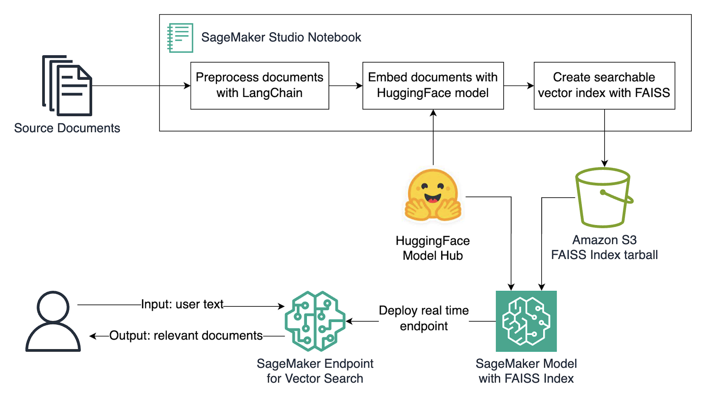

# Deploy a Vector Search Microservice with Amazon SageMaker

Retrieval augmented generation (RAG) systems require the ability to match input text to document corpora in order to retrieve relevant factual information as context to a large language model (LLM) to reduce hallucinations. There are many ways to set up vector search capabilities on AWS such as [OpenSearch Vector Engine](https://aws.amazon.com/opensearch-service/serverless-vector-engine/) and [pgvector with Amazon Aurora](https://aws.amazon.com/blogs/database/leverage-pgvector-and-amazon-aurora-postgresql-for-natural-language-processing-chatbots-and-sentiment-analysis/). 

When a retrieval corpus is relatively small, fits into a single instance's random access memory once vectorized, and can be updated in a semi-regular cadence the [FAISS](https://github.com/facebookresearch/faiss) framework in conjunction with [Amazon Sagemaker](https://aws.amazon.com/sagemaker/) is a great way to stand up a real time vector search API system in a quick and easy fashion. 

This repository shows how to use [SageMaker's real-time inference endpoints](https://docs.aws.amazon.com/sagemaker/latest/dg/realtime-endpoints.html) to host a real time vector search microservice built on the [FAISS](https://github.com/facebookresearch/faiss) framework. By using Amazon SageMaker's real-time model inference endpoints, this repository illustrates how to utilize the power and flexibility of SageMaker hosting in conjunction with open source in-memory vector search frameworks and embedding models.

*Please Note:* The document corpus used in this example is a point in time scrape of the [SageMaker FAQ page](https://aws.amazon.com/sagemaker/faqs/). Because of this, the FAQs provided as a dataset can be out of date and should NOT be used as a factual piece of information for the SageMaker service. Only use this dataset as an example piece of text and do NOT rely on it for information regarding Amazon SageMer. Please refer to the live FAQ page provided in the link previously for up to date factual information.

## Getting Started

In order to run the example in this repo, navigate to the [notebook](./deploy-faiss-microservice.ipynb). This notebook can be run end-to-end in [Sagemaker Studio](https://aws.amazon.com/sagemaker/studio/). We recommend using the Python 3 (Data Science 3.0) with Python 3.10, and a ml.m5.large instance inside of SageMaker Studio to run the notebook. However, you are also able to run this notebook in a local environment if you have an authenticated role to AWS which has SageMaker permissions attached to it. Running through the notebook you will be able to...

1. Split a document of text using [LangChain](https://python.langchain.com/docs/get_started/introduction)
2. Index the document chunks into FAISS using an embedding model from HuggingFace
4. Save a serialized FAISS vector index to Amazon S3
5. Create a SageMaker model object from this serialized index
6. Deploy a SageMaker real time endpoint with a custom script for search retrieval
7. Send a text into the SageMaker endpoint for document retrieval and return relevant documents to the input text in real time
8. Delete the SageMaker endpoint

## How it Works

This repository deploys a SageMaker endpoint with a custom inference script similar to this [example in the SageMaker SDK documentation](https://sagemaker-examples.readthedocs.io/en/latest/introduction_to_amazon_algorithms/xgboost_abalone/xgboost_inferenece_script_mode.html). The components required to deploy a pre-trained model to an endpoint in SageMaker are 1) a serialized model artifact (tar file) in Amazon S3 and 2) the code and requirements which runs inference. These components are then packaged into a SageMaker endpoint which serves the serialized model with custom code behind as an API. See the architecture below for a visual description.

## Contributing

Please see the [CONTRIBUTING](./CONTRIBUTING.md) file for details on contributing.

## License

This library is licensed under the MIT License. See the [LICENSE](./LICENSE) file for specifics.

## Disclaimer

This guidance is for informational purposes only.  You should still perform your own independent assessment, and take measures to ensure that you comply with your own specific quality control practices and standards, and the local rules, laws, regulations, licenses and terms of use that apply to you, your content, and the third-party generative AI service referenced in this guidance.  AWS has no control or authority over the third-party generative AI service referenced in this guidance, and does not make any representations or warranties that the third-party generative AI service is secure, virus-free, operational, or compatible with your production environment and standards. AWS does not make any representations, warranties or guarantees that any information in this guidance will result in a particular outcome or result.  
